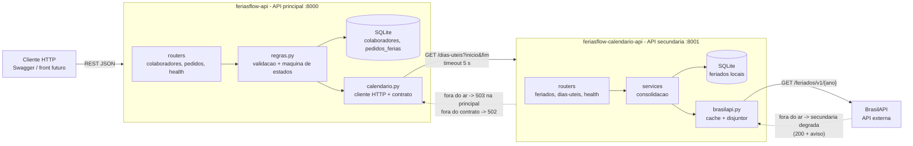
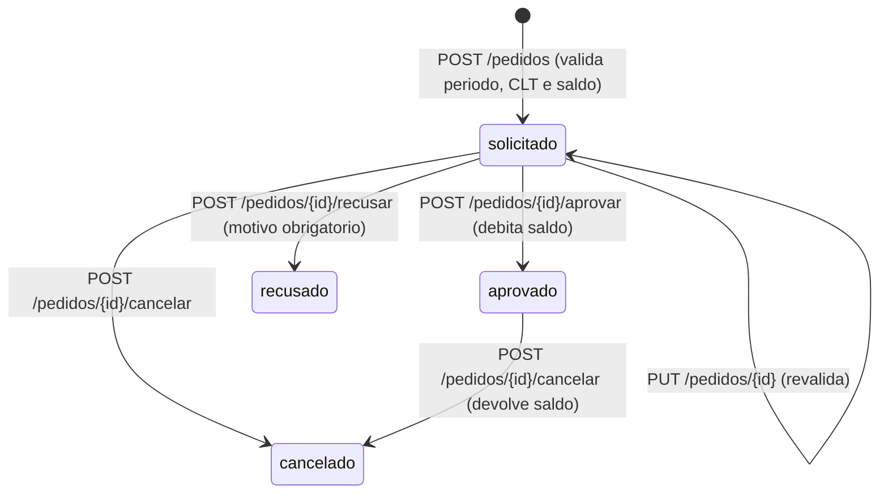

# FeriasFlow API

API **principal** do MVP da Sprint *Arquitetura de Software* (pos-graduacao em Engenharia de
Software, PUC-Rio). **FeriasFlow** e uma aplicacao para planejamento e aprovacao de ferias de
equipes: o colaborador solicita, o sistema valida o periodo contra o calendario (dias uteis,
feriados e regras da CLT) e contra o saldo, e o gestor aprova, recusa ou cancela.

Continuidade do produto idealizado na Sprint de Gestao Agil
([FSEB-SW/ferias-flow-mvp](https://github.com/FSEB-SW/ferias-flow-mvp): Lean Inception, backlog e
wireframes). Aqui a feature *Validacao de saldo e regras CLT* (F8 do backlog) sai do papel.
Aluno: Julio Frois.

## Componentes (Cenario 2.1 do enunciado)

| Componente | Repositorio | Papel |
|---|---|---|
| API principal | **este repositorio** | colaboradores, saldo, pedidos de ferias e decisao do gestor; `docker-compose.yml` |
| API secundaria | [FSEB-SW/feriasflow-calendario-api](https://github.com/FSEB-SW/feriasflow-calendario-api) | feriados locais + contagem de dias uteis |
| API externa | [BrasilAPI - Feriados Nacionais](https://brasilapi.com.br/docs#tag/Feriados-Nacionais) | `GET /feriados/v1/{ano}`, publica e gratuita, sem cadastro; consumida pela secundaria |

Fluxo: **principal -> secundaria -> externa**. A principal nunca fala com a BrasilAPI: quem
conhece a fonte externa e o servico de calendario.

## Arquitetura e fluxo



Ciclo de vida do pedido (agregado `PedidoFerias`):



## Decisoes de arquitetura (e seus trade-offs)

1. **Dois servicos, nao um monolito modular.** Para o FeriasFlow real, um monolito modular
   (a escolha padrao recomendada na disciplina de microsservicos) bastaria. O corte em dois
   servicos existe porque o MVP pede comunicacao entre componentes, e o corte escolhido e o que
   faria sentido se um dia a separacao fosse necessaria: o dominio *calendario* tem coesao propria,
   ciclo de mudanca diferente (feriados mudam uma vez por ano; pedidos, todo dia) e concentra a
   dependencia externa. Custo: um salto de rede, dois deploys, dois bancos.
2. **Acoplamento de dominio via contrato explicito.** A principal so conhece `GET /dias-uteis`
   e o formato descrito em `contratos/dias-uteis.schema.json`, testado nos dois repositorios
   (teste de contrato dirigido pelo consumidor). Nada de banco compartilhado.
3. **Comunicacao sincrona (request-response) com falha explicita.** Solicitar ferias precisa
   da resposta do calendario na hora; eventos assincronos nao cabem aqui. Se a secundaria cair,
   a principal responde **503** com mensagem clara e nao persiste nada; se ela responder fora do
   contrato, **502**. Timeout de 5 s configuravel. A secundaria, por sua vez, degrada sem
   derrubar a principal se a BrasilAPI cair (200 + `aviso`, que fica gravado no pedido em
   `aviso_calendario` para o gestor saber que feriados nacionais nao foram considerados).
4. **Um agregado por servico, com maquina de estados no codigo.** `PedidoFerias` e o agregado
   raiz da principal; `Feriado` o da secundaria. As transicoes validas estao em `app/regras.py`,
   nao espalhadas pelas rotas: quem le a tabela `TRANSICOES` entende o ciclo de vida.
5. **Saldo com reserva.** Pedidos em analise reservam dias (`dias_reservados`); aprovar debita,
   cancelar um aprovado devolve. Evita que dois pedidos pendentes estourem o saldo.
6. **SQLite por servico, SQLAlchemy 2 e FastAPI.** Persistencia simples e suficiente para o MVP,
   com o ORM isolando o banco (trocar por PostgreSQL e trocar a `DATABASE_URL`). FastAPI da o
   OpenAPI/Swagger e a validacao Pydantic de graca.
7. **Docker + pipeline + registro de imagens.** Cada servico tem Dockerfile (imagem slim,
   usuario sem privilegio, `HEALTHCHECK`) e um workflow que roda testes, constroi a imagem e faz
   smoke test no `/health`. O pipeline da secundaria ainda **publica a imagem** no GitHub
   Container Registry a cada merge na `main`; o `docker-compose.yml` (so aqui, na raiz da
   principal) consome esse artefato publicado em vez de construir o codigo do outro servico.
   E o que a disciplina de DevOps chama de pipeline de implantacao: o consumidor usa o artefato
   versionado, nao o fonte. Para desenvolver os dois lados, o `docker-compose.local.yml` troca a
   imagem publicada pelo clone local.

## Regras de negocio do pedido

| # | Regra | Resposta |
|---|---|---|
| 1 | `fim >= inicio`; `inicio` nao pode estar no passado | 422 |
| 2 | minimo de 5 dias corridos (CLT art. 134, par. 1) | 422 |
| 3 | inicio nao cai em sexta, sabado ou domingo, nem nos 2 dias que antecedem feriado (CLT art. 134, par. 3) - feriados vem da API de calendario | 422 |
| 4 | dias corridos <= saldo disponivel (saldo - dias reservados por pedidos em analise) | 422 |
| 5 | sem sobreposicao com outro pedido solicitado/aprovado do mesmo colaborador | 409 |
| 6 | colaborador precisa existir e estar ativo | 404 / 422 |
| 7 | so pedido `solicitado` pode ser alterado; `aprovado` nao pode ser excluido (cancele antes) | 409 |

## Rotas

| Metodo | Rota | Descricao |
|---|---|---|
| GET | `/colaboradores?equipe=&ativo=` | lista com saldo, dias reservados e saldo disponivel |
| GET | `/colaboradores/{id}` | obtem |
| POST | `/colaboradores` | cadastra (`nome`, `email`, `equipe`, `saldo_dias` = 30) |
| PUT | `/colaboradores/{id}` | atualiza (parcial) |
| DELETE | `/colaboradores/{id}` | remove (409 se houver pedido solicitado/aprovado) |
| GET | `/pedidos?colaborador_id=&status=&ano=&pagina=&tamanho=` | lista paginada com filtros |
| GET | `/pedidos/{id}` | obtem |
| POST | `/pedidos` | solicita ferias (valida no calendario) |
| PUT | `/pedidos/{id}` | altera periodo/observacao (revalida) |
| DELETE | `/pedidos/{id}` | exclui |
| POST | `/pedidos/{id}/aprovar` | gestor aprova (debita saldo) |
| POST | `/pedidos/{id}/recusar` | gestor recusa (`motivo`) |
| POST | `/pedidos/{id}/cancelar` | cancela (devolve saldo se estava aprovado) |
| GET | `/health` | estado do servico, do banco e da API de calendario |

Swagger: `http://localhost:8000/docs`.

Exemplo (novembro de 2026: 15/11 cai no domingo e 20/11 e feriado na sexta):

```
POST /pedidos  {"colaborador_id": 1, "inicio": "2026-11-09", "fim": "2026-11-20"}
201 {"id": 1, "status": "solicitado", "dias_corridos": 12, "dias_uteis": 9, ...}

POST /pedidos  {"colaborador_id": 1, "inicio": "2026-11-18", "fim": "2026-11-27"}
422 {"detail": "inicio nos 2 dias que antecedem feriado (2026-11-20 - Dia da consciencia negra) (CLT art. 134, par. 3)"}
```

## Como executar

Com Docker Compose (sobe os dois servicos; so precisa deste repositorio clonado):

```bash
docker compose up --build
```

- API principal: <http://localhost:8000/docs>
- API secundaria: <http://localhost:8001/docs>

A imagem da secundaria (`ghcr.io/fseb-sw/feriasflow-calendario-api:latest`) e publicada pelo
pipeline dela e puxada aqui; so a principal e construida localmente. Para construir a
secundaria a partir de um clone local ao lado (`../feriasflow-calendario-api`):

```bash
docker compose -f docker-compose.yml -f docker-compose.local.yml up --build
```

Sem Docker (Python 3.12), com a secundaria ja rodando na porta 8001:

```bash
python -m venv .venv && .venv\Scripts\activate    # Windows; no Linux: source .venv/bin/activate
pip install -r requirements.txt
uvicorn app.main:app --reload --port 8000
```

Variaveis: `DATABASE_URL` (padrao `sqlite:///./data/feriasflow.db`), `CALENDARIO_URL`
(padrao `http://localhost:8001`), `CALENDARIO_TIMEOUT` (5 s), `MINIMO_DIAS_CORRIDOS` (5).

## Testes

```bash
pip install -r requirements-dev.txt
pytest -q
```

Vinte e seis testes, sem rede (a API de calendario e substituida por uma dubla com a mesma
interface):

- colaboradores: CRUD, e-mail duplicado, remocao bloqueada com pedido ativo;
- pedidos: cada regra da tabela acima, paginacao e filtros;
- integracao: calendario fora do ar (503, nada persistido), fora do contrato (502), degradado
  (aviso gravado no pedido);
- maquina de estados: aprovar/recusar/cancelar, efeitos no saldo, transicoes invalidas (409);
- **contrato (consumidor)**: `tests/test_contrato.py` valida um exemplo real da resposta do
  produtor contra `contratos/dias-uteis.schema.json` e prova que o cliente consome esse formato e
  rejeita respostas fora dele. O produtor testa contra o mesmo arquivo.

## Pipeline (GitHub Actions)

`.github/workflows/ci.yml`: a cada push ou pull request roda `pytest`, constroi a imagem e sobe o
container para conferir o `/health`. Entrega por pull request; `main` so recebe merge de PR.

## Estrutura

```
app/
  main.py          aplicacao FastAPI e rotas montadas
  config.py        variaveis de ambiente
  database.py      engine/sessao SQLAlchemy (SQLite, FK ligada)
  models.py        Colaborador e PedidoFerias (agregado)
  schemas.py       contratos Pydantic de entrada/saida, paginacao
  calendario.py    cliente da API secundaria (contrato, 502/503)
  regras.py        regras de negocio e maquina de estados
  routers/         colaboradores.py, pedidos.py, health.py
contratos/         dias-uteis.schema.json (copia identica no produtor)
tests/             pytest (dubla do calendario, sem rede)
Dockerfile         imagem python:3.12-slim, usuario sem privilegio, HEALTHCHECK
docker-compose.yml principal (build local) + secundaria (imagem publicada no GHCR)
docker-compose.local.yml  override: secundaria construida do clone local
```
